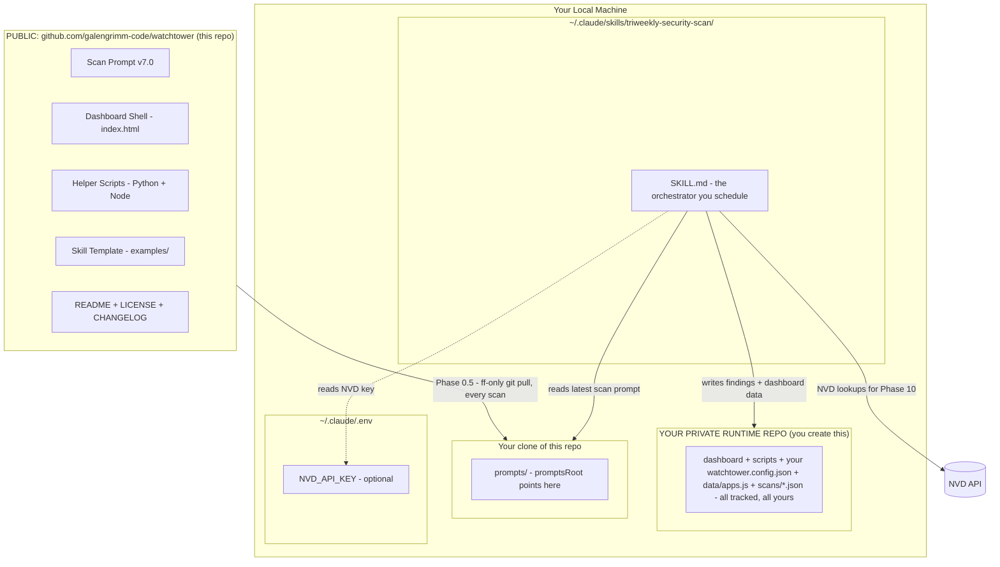
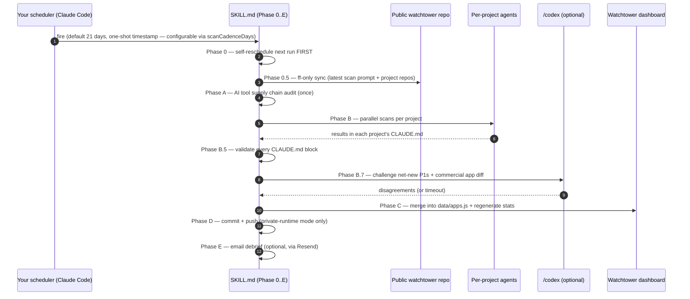

<p align="center">
  
</p>

<h1 align="center">Watchtower</h1>

<p align="center">
  <em>Triweekly security scan for solo-dev and small-team code portfolios.</em><br>
  <em>Catches drift across code, DNS, deployed surface, and AI tool supply chain.</em><br>
  <em>Built for Claude Code. MIT licensed.</em>
</p>

Watchtower is a methodology + dashboard for the kind of developer who runs a dozen side projects, ships a paid SaaS app, and forgets which one has Stripe webhooks without signature verification. The scan runs on whatever cadence you set in `watchtower.config.json` (default: every 21 days — hence the "triweekly" branding), finds what's drifted, and refreshes a static HTML dashboard so you can see the whole portfolio at a glance.

It does **not** replace per-PR review tools, professional penetration testing, or a real CSPM. It's a continuous low-effort hygiene loop for portfolios where a full security program would be overkill.

---

## What you get

| Piece | What it does | Where it lives |
|---|---|---|
| Scan prompt | 1900+ lines of "what to check, what to flag," currently at v7.0 with OWASP Top 10 (2021) categorization, per-app strengths, and silent-failure / memory-growth sweeps | `prompts/security-scan-prompt.md` |
| Dashboard | Static HTML viewer for flag burndown, OWASP coverage, AI tool intel, and per-app A–F health grades | `index.html` (data populates over time from your scheduled scans) |
| Helper scripts | Three small Python + Node scripts that parse CLAUDE.md scan blocks, merge results, and generate stats | `scans/` |
| Scheduled-scan skill | **The thing you download and schedule.** Wires Phases 0 → 0.5 → A → B → B.5 → B.7 → C → D → E into a self-rescheduling loop on whatever cadence you configure (default: every 21 days), pulling the latest scan prompt from this repo on every run | `examples/triweekly-security-scan.SKILL.md.template` |
| Config | One JSON file with your project list, portfolio root, and exclusions — everything else derives from this | `watchtower.config.example.json` |

---

## Architecture

Watchtower is three pieces: a **public methodology repo** (this one — the scan prompt and dashboard shell, maintained upstream), a **private runtime repo you own** — your dashboard, your config, and every scan's findings, committed and pushed as history — and a **skill** you install at `~/.claude/skills/` and schedule with Claude Code on whatever cadence you set in `watchtower.config.json` (default: every 21 days). You keep a local clone of this public repo and point `promptsRoot` at it; on each run the skill syncs it (Phase 0.5) so every scan executes the latest methodology, then scans your portfolio and writes results into your runtime. The public repo has no data — your findings live in your repo, not this one.



Your audit findings are an asset — flag burndown, grade history, per-scan JSONs — and they're security-sensitive, so they belong in a **private repo you own**, committed every cycle by Phase D. Methodology updates flow the other direction automatically: Phase 0.5 does a fast-forward-only `git pull` on your clone of this repo before every scan (pin it to a release tag if you'd rather review prompt changes first). Two repos, no fork relationship. This is the setup the author runs.

**Just kicking the tires?** A plain clone of this repo works as a throwaway runtime — your config and dashboard data are gitignored here, so they stay local-only with no history. One side effect is *not* local even in trial mode: scans still write SCAN:AUTO blocks into each scanned project's CLAUDE.md and commit them in those projects' repos. Fine for a trial run; move to a private runtime repo before you rely on it.

---

## The scan cycle (default 21 days, configurable)



Phase 0 self-reschedules first, **before anything else runs**. If the scan crashes anywhere downstream, the next run is still armed. Skip this and a crashed scan means a dead chain until you notice.

---

## Prerequisites

- [Claude Code](https://claude.com/claude-code) 2.1.34 or newer
- Node.js 18+
- Python 3.10+
- `gh` CLI (recommended; the quick start uses it to create your private runtime repo — the GitHub web UI works as a substitute — and scans use it for repo visibility checks)
- [NVD API key](https://nvd.nist.gov/developers/request-an-api-key) (optional, free, 30-second signup) — gives Phase 10 cross-validation higher rate limits
- [Codex CLI](https://github.com/openai/codex) (optional) — required only if you want Phase B.7 adversarial review

Everything optional is genuinely optional. The scan runs and produces a dashboard with none of them. The "best" run uses all of them.

---

## Quick start (~5 minutes)

Commands below are bash — on Windows, run them from **Git Bash** (ships with [Git for Windows](https://gitforwindows.org/)), not PowerShell.

```bash
# 1. Clone this repo — it's the methodology source your scans will pull prompt
#    updates from (Phase 0.5 syncs it before every scan).
git clone https://github.com/galengrimm-code/watchtower

# 2. Create YOUR private runtime repo, seeded from the public files.
#    This is where your dashboard and audit findings will live.
#    (No gh CLI? Create a private repo in the GitHub web UI, clone it, and
#    continue from the cd line.)
gh repo create your-org/watchtower-runtime --private --clone
cd watchtower-runtime
git pull ../watchtower main

# 3. Make your scan data trackable. The inherited .gitignore deliberately
#    ignores data/*.js, scans/*.json, and watchtower.config.json — right for
#    the public repo, wrong for YOUR private runtime. Your findings should
#    be committed history, not loose files.
$EDITOR .gitignore
# delete the "Runtime data", "Per-scan history", and "Your real config"
# entries; keep the backup (*.bak) and standard-noise sections.

# 4. Copy the example config and edit it
cp watchtower.config.example.json watchtower.config.json
$EDITOR watchtower.config.json
# set portfolioRoot, watchtowerRoot (this runtime repo), projects, and
# promptsRoot -> the prompts/ folder inside your clone from step 1

# 5. Install the scan skill (this is the orchestrator you'll schedule)
mkdir -p ~/.claude/skills/triweekly-security-scan
cp examples/triweekly-security-scan.SKILL.md.template \
   ~/.claude/skills/triweekly-security-scan/SKILL.md
$EDITOR ~/.claude/skills/triweekly-security-scan/SKILL.md
# replace <WATCHTOWER_CONFIG_PATH> with the absolute path to your watchtower.config.json

# 6. (Optional) add NVD API key for higher Phase 10 rate limits
echo "NVD_API_KEY=YOUR_KEY_HERE" >> ~/.claude/.env

# 7. Open the dashboard locally to confirm it loads
# Windows
start index.html
# macOS
open index.html
```

Then schedule it — tell Claude Code:

> "Schedule a one-time run of the triweekly-security-scan skill tomorrow at 9pm."

That's the only scheduling you ever do by hand. Phase 0 of every run arms the next one at `now + scanCadenceDays`, so the chain keeps itself alive.

On first run the dashboard is empty (no `data/apps.js` yet). It populates after the first scan. Impatient? Tell Claude Code to run the skill now instead of waiting for the schedule.

---

## What the scan catches

Roughly 120+ flag categories grouped by what they look at:

| Surface | Examples |
|---|---|
| Code (STEP 1) | Hardcoded secrets, git-history secret leaks, npm audit P1s, SSRF user-URL-fetch, webhook replay, path traversal, prototype pollution, source maps in prod, dangerous innerHTML, LLM output rendered to DOM, swallowed exceptions (silent catch blocks), unbounded in-memory growth |
| DNS + deployed surface (STEP 1B) | Missing security headers (HSTS, CSP, X-Frame-Options, Referrer-Policy), CORS origin reflection + credentials, exposed sensitive endpoints (/.env, /.git/HEAD, /backup.sql), DMARC/SPF/DKIM/CAA gaps, unauthenticated cron/webhook endpoints |
| AI tool supply chain (STEP 1C, runs once per cycle) | Vulnerable MCP servers, unsafe-list skills/plugins/hooks, memory-poisoning patterns, secrets in `.claude/`, outdated Claude Code, NVD cross-validation against the community threat-db |
| Hygiene + tooling | Files over 1,500 lines (uniform threshold since v6.8), missing ESLint config, no `lint` script, missing .nvmrc, no security.txt, Prettier drift, CI not gating on lint |
| Docs freshness (Phase C, deterministic script) | Dev commands that no longer exist in package.json, doc references to deleted files, SESSION-HANDOFF.md trailing the commit history, expired `Last reviewed:` dates — one consolidated `stale-docs` flag per project |

Severity follows P1 (active risk) → P4 (hygiene). Each project's `CLAUDE.md` gets a SCAN:AUTO block with the same shape — easy to diff across runs.

### Health grades & strengths (v7.0)

Two outputs aimed at "how is the portfolio doing," not just "what's broken":

- **Health grade (A–F)** — each scanned app gets a letter badge on its dashboard card, computed client-side from data the scan already emits: active flag severities, files over the size threshold, test-framework presence, and scan recency. Accepted and resolved flags don't count — accepting a risk is a decision, not a defect. Click the badge for the full deduction breakdown. The formula lives in one function (`healthGradeFor` in `index.html`) — tune the weights to your own taste.
- **Strengths line** — every scan writes one concrete, verified sentence on what the codebase does *well* ("Signature-verified Stripe webhooks, RLS on every queried table"). It renders on the card and tells a future refactor — human or AI — what not to break.

---

## OWASP Top 10 (2021) coverage

Each flag category that maps to an OWASP Top 10 (2021) item carries an optional `owasp` field. AI supply-chain and hygiene flags intentionally don't map — those are real risks OWASP doesn't track.

| OWASP | Watchtower coverage |
|---|---|
| A01 Broken Access Control | webhook signature, period locking, audit log gaps |
| A02 Cryptographic Failures | hardcoded secrets, secrets in git history, weak auth cookie attrs |
| A03 Injection | SSRF, path traversal, open redirect, dangerous innerHTML, LLM-output DOM render |
| A04 Insecure Design | missing rate limiting, missing audit log, missing period locks |
| A05 Security Misconfiguration | missing security headers, source maps in prod, CORS reflection, exposed endpoints |
| A06 Vulnerable & Outdated Components | npm audit, EOL Node versions, unpinned GHA actions |
| A07 Identification & Auth Failures | auth-endpoint rate limiting, tokens in localStorage |
| A08 Software & Data Integrity | webhook replay, unpinned actions, prototype pollution, install scripts |
| A09 Logging & Monitoring | missing audit log, debug logging in prod, swallowed exceptions |
| A10 SSRF | dedicated SSRF user-URL-fetch grep + live probe |

The mapping was inspired by the structured threat-modeling approach in gstack's `cso` skill; the implementation is original.

---

## Phase B.7 — Codex adversarial review (optional)

If `/codex` is installed and authenticated, Watchtower runs a focused second-opinion pass after Phase B finishes:

1. **Net-new P1 challenge** — diffs this cycle's P1 flags against the previous cycle. Up to 3 net-new entries get sent to `/codex challenge`, which is asked to argue the flag is wrong or find a counterexample.
2. **Commercial-app CLAUDE.md review** — if `config.commercialAppSlug` is set, the diff to that project's CLAUDE.md gets sent to `/codex review`. Codex's job is to check whether the scan actually read the codebase or hallucinated architecture details.

Every Codex call is wrapped in a 60-second timeout. If Codex hangs on an auth prompt, the scan still ships — just without the second opinion.

Codex disagreements land in the Phase D commit message under `## Codex second opinion` so you see them in the next time you `git log`.

---

## Customizing the scan

- **Add a new check**: edit `prompts/security-scan-prompt.md`. The taxonomy and OWASP mapping live in dedicated sections — keep both in sync when adding categories.
- **Add a new project**: append an entry to `watchtower.config.json`'s `projects` array. The next scheduled run picks it up.
- **Skip a project for one cycle**: add its folder to `exclusions`. Re-enable by removing.
- **Change the cadence**: set `scanCadenceDays` in `watchtower.config.json`. The skill computes the next fire date as `now + scanCadenceDays`, so this can be anything from daily (`1`) to monthly (`30`) to quarterly (`90`) or longer. Default is `21`. The name "triweekly" is just the default — pick whatever cadence matches how fast your portfolio drifts.
- **Drop a check**: delete the relevant grep block from the prompt. The dashboard tolerates missing categories — it renders whatever's there.

### Configuring display categories

Each project on the dashboard belongs to a **display category** (the colored chip on its card, the filter pill at the top of the grid). These are user-defined — name them whatever fits your portfolio.

The dashboard reads display categories from `watchtower.config.json` under the `categories` key:

```json
"categories": {
  "Active":     { "color": "#4caf50", "excludeFromStats": false, "sortOrder": 1 },
  "Commercial": { "color": "#5b9bd5", "excludeFromStats": false, "sortOrder": 2 },
  "Tool":       { "color": "#b388d9", "excludeFromStats": false, "sortOrder": 3 },
  "Experiment": { "color": "#d4a843", "excludeFromStats": true,  "sortOrder": 4 },
  "Archived":   { "color": "#888888", "excludeFromStats": true,  "sortOrder": 99, "dim": true }
}
```

Per entry:

- `color` — either a single hex string (used as the accent) or a full object `{bg, border, accent, tag}` for fully tinted cards (matches the styling on the screenshot at the top of this README).
- `excludeFromStats` — when true, projects in this category are dropped from aggregate dashboard stats (P1/P2/P3/P4 totals, completion average, etc.) but still appear in the grid. Useful for "Archived" / "Experiment" categories you want to see but not include in the headline numbers.
- `sortOrder` — lower sorts earlier in the filter pill bar. Use `99+` to sink the category to the bottom of the grid (Watchtower's legacy "Archived sorts last" behavior is just `sortOrder: 99`).
- `dim` — optional. When true, cards in this category render at 72% opacity until expanded. Visual hint for "this is a parked project."

**Categories not in the map still appear** — they just get neutral gray styling and sort middle. So you can leave `categories` empty (or delete it) and the dashboard still works; it just looks flatter. Add entries only for categories you want styled.

Projects reference categories by exact-match in their `data/apps.js` entry's `category` field. If you add a new category to the config, set at least one project's `category` to that name and re-open the dashboard.

---

## Security considerations

A few caveats this project doesn't try to hide:

- **Not a replacement for `/security-review`.** Per-PR diff review and Watchtower's portfolio sweep solve different problems. Run both.
- **Not a replacement for professional pentesting.** Watchtower catches drift and misconfigurations. It doesn't model adversaries, run fuzzing, or exercise business logic flaws.
- **Community threat-db is single-maintainer** (~30 source advisories). Treat findings as advisory. Cross-check critical flags against NVD/Snyk before acting on commercial code. Phase 10 helps but isn't a replacement for human judgment.
- **STEP 1B live probes hit your own deployed sites.** Never point Watchtower at domains you don't own. The probes are benign GETs against your own apex — read the prompt before running.
- **The dashboard is static HTML with no auth.** Don't serve `data/apps.js` publicly if it contains private repo URLs, internal paths, or vulnerability details.

---

## Contributing

See [CONTRIBUTING.md](CONTRIBUTING.md). Short version: small PRs, one concern at a time, threat model required for new checks.

For security issues in Watchtower itself, open a private security advisory through GitHub's Security tab.

---

## License

MIT — see [LICENSE](LICENSE). Use it however you want.

---

## Acknowledgments

- **v6.6 adversarial-review additions**: [OpenAI Codex](https://github.com/openai/codex)
- **v6.7 OWASP framing**: inspired by [gstack](https://github.com/garrettmoon/gstack)'s `cso` skill (no code copied, implementation is original)
- **v7.0 audit dimensions** (silent failures, memory growth, strengths, health grade): adapted from community "repo audit" prompt patterns
- **AI tool threat database**: [FlorianBruniaux/claude-code-ultimate-guide](https://github.com/FlorianBruniaux/claude-code-ultimate-guide)
- **CVE cross-validation**: [NIST National Vulnerability Database](https://nvd.nist.gov/)
- **Claude Code**: [Anthropic](https://claude.com/claude-code)
